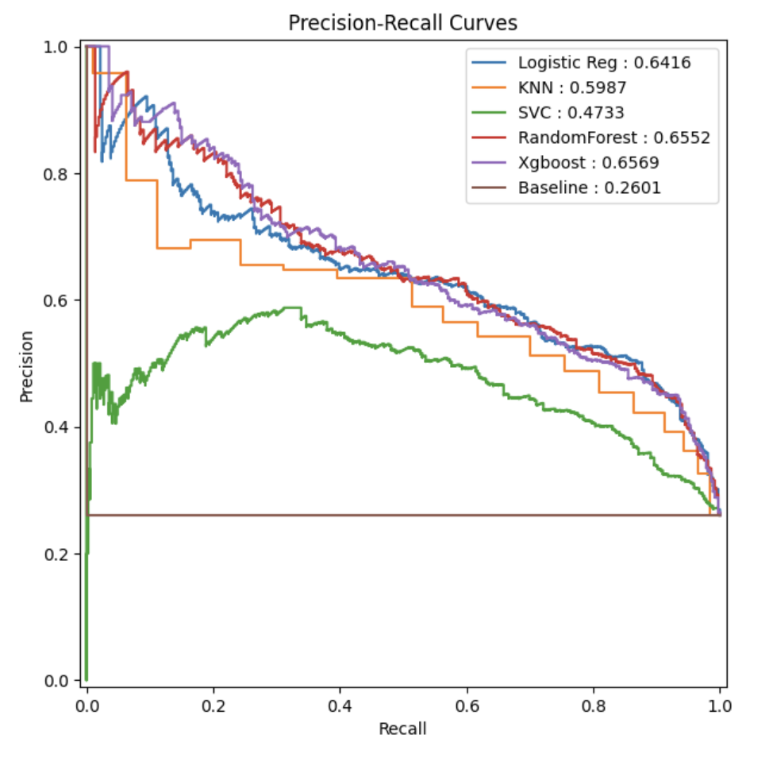
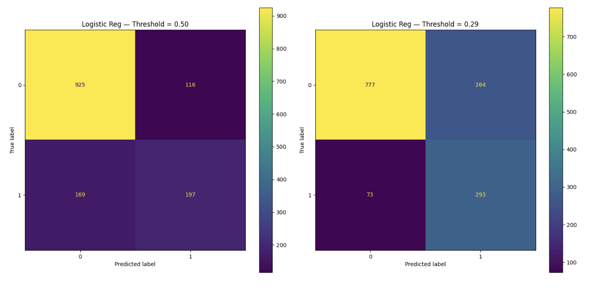
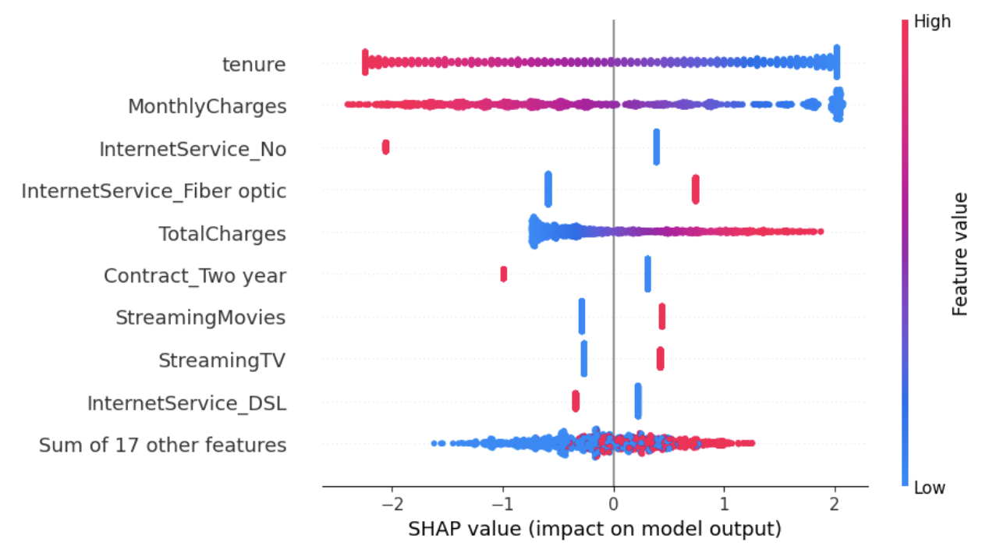
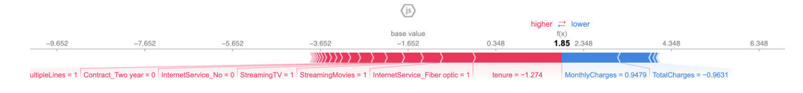
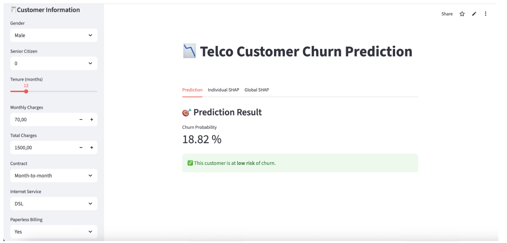
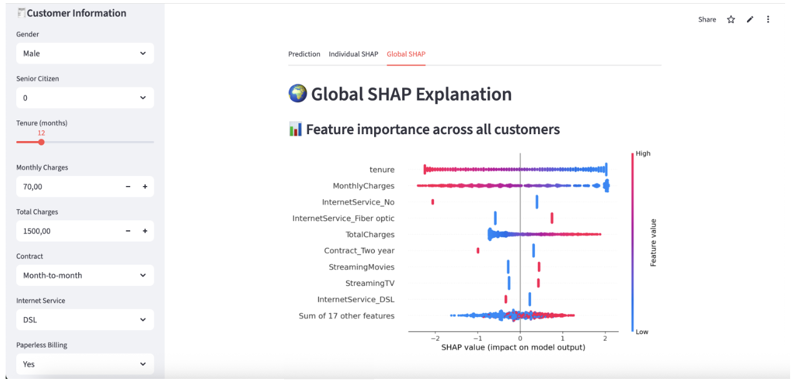
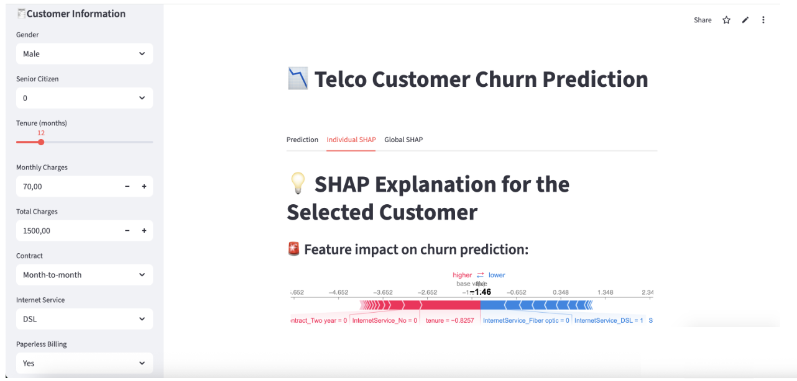

# Reduce Customer Churn with Predictive Analytics

## Business Problem

In the telecom industry, acquiring new customers is significantly more expensive than retaining existing ones.  
Identifying subscribers at high risk of churn enables proactive retention strategies and prevents substantial revenue loss.

How can we detect at‑risk customers *before* they leave?

## Proposed Solution

A full end‑to‑end predictive pipeline to identify customers likely to churn and support targeted retention actions.

**Key steps:**

- Data cleaning and exploratory data analysis (EDA).
- Predictive models: Logistic Regression and XGBoost.
- Threshold optimization to maximize Recall (0.53 → 0.80).
- Model interpretability with SHAP — identifying key churn drivers.
- Deployment as an interactive Streamlit app for real‑time predictions.

## Results

| Metric | Score |
|--------|-------|
| Accuracy | 76% |
| Recall | 81% |
| Threshold optimization | Recall from 0.53 to 0.80 |

SHAP analysis identifies the main churn drivers: contract type, internet service, customer tenure.

## Technologies

- Python
- Pandas
- Scikit‑learn
- XGBoost
- Logistic Regression
- SHAP
- Streamlit
- Matplotlib
- Seaborn

## Business Impact

- Fewer lost customers → lower acquisition costs.
- Personalized retention offers for high‑risk profiles.
- Actionable insights into churn drivers for marketing teams.

## Model Results

### Final Performance

  
- *Precision‑Recall curves show the model’s performance across different thresholds.*

### Confusion Matrix

  
- *Confusion matrix illustrates true positives, false positives, and other misclassifications.*  

### SHAP Interpretability

  
- *Global SHAP plot shows the main features driving churn predictions.*  

  
- *Individual SHAP explanations highlight why specific customers are classified as high‑risk.*  

## Streamlit Application

**Live demo:** [https://laffineur-telco-churn.streamlit.app/](https://laffineur-telco-churn.streamlit.app/)  

  
- *Prediction screen for real‑time churn risk assessment.*  

  
- *Global SHAP explanations for key churn drivers.*  

  
- *Individual SHAP explanations for specific customers.*
